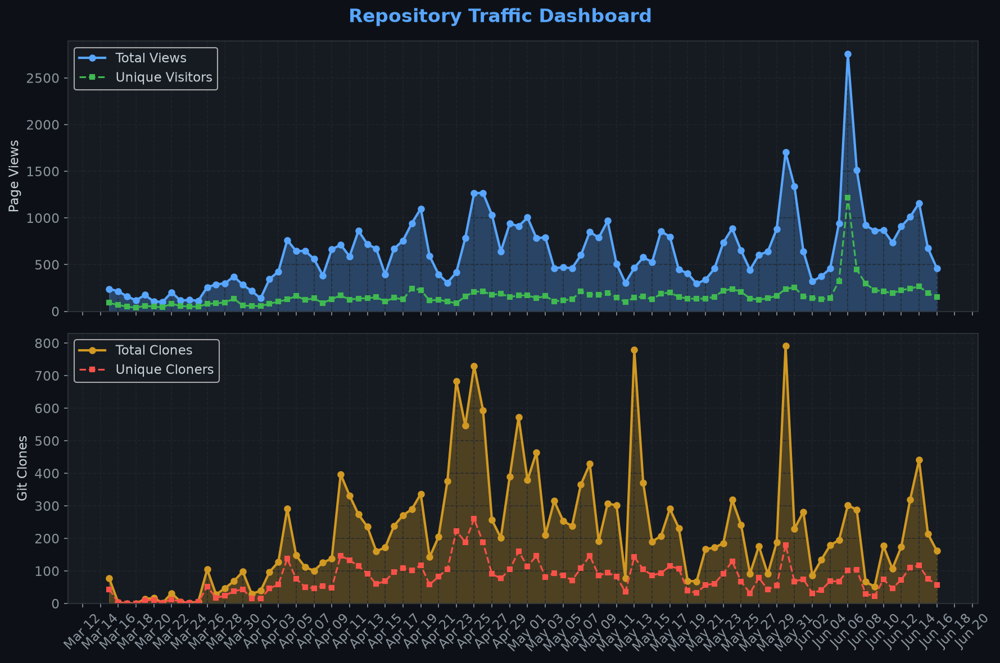
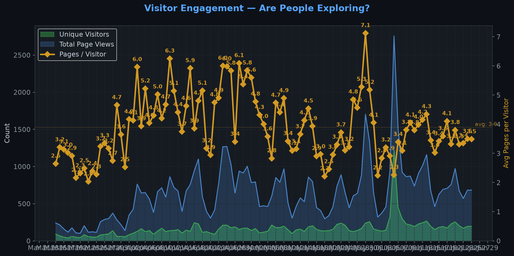
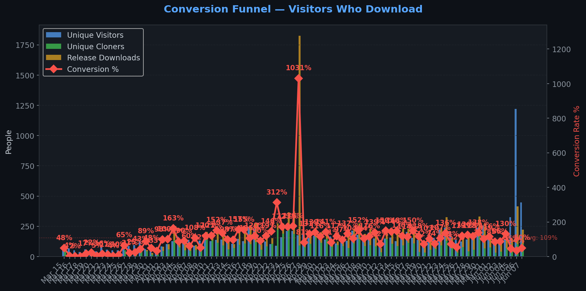
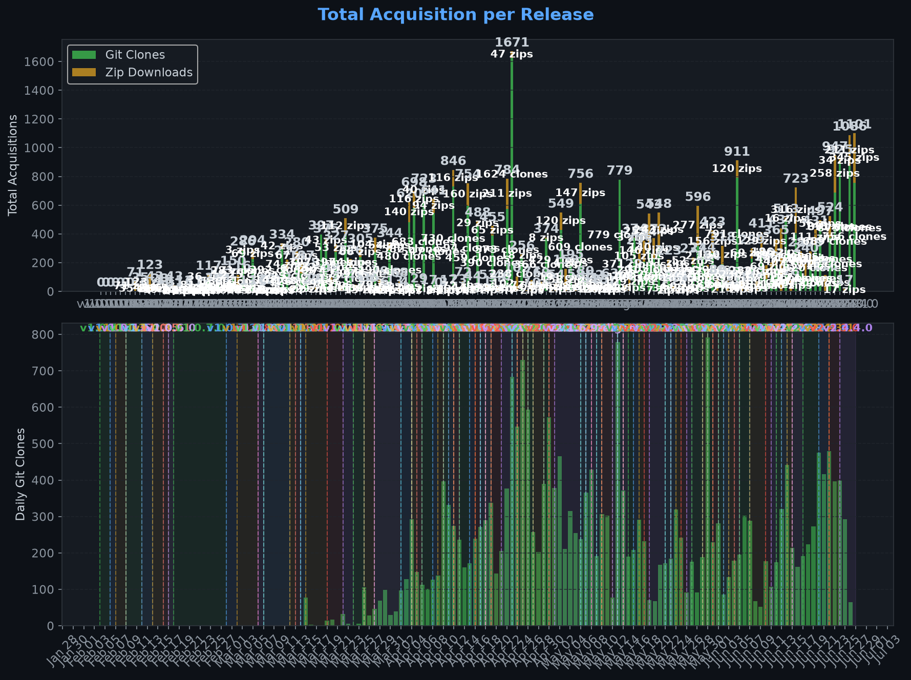
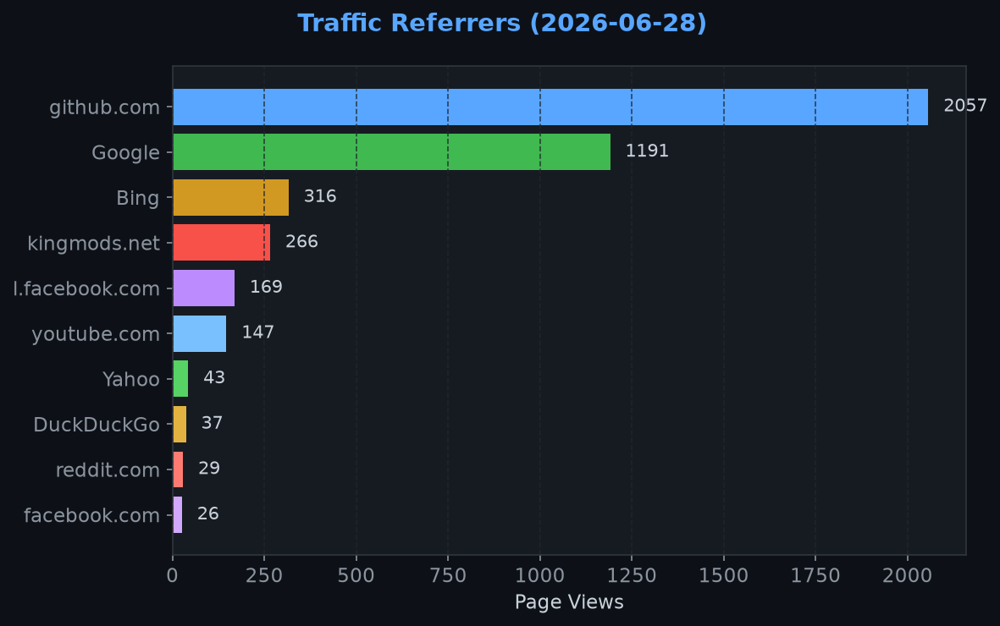
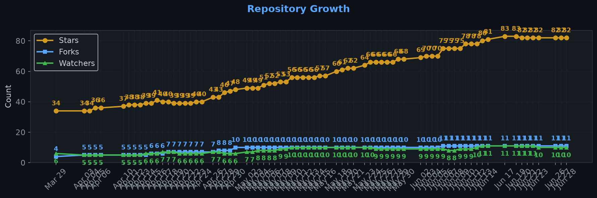

# Repository Traffic Dashboard

**Last updated:** 2026-06-28T00:07:38Z
**Days tracked:** 74 | **Download snapshots:** 880 (hourly)

---

## Views & Clones (14-day window, preserved forever)

| Metric | 14-Day Total | Unique |
|--------|-------------|--------|
| Page Views | 10151 | 1339 |
| Git Clones | 4348 | 1058 |

> **Engagement:** 7.5 pages per visitor (14-day avg)

---

## Visitor Engagement

> Higher = visitors exploring more pages. 1.0 = bounce. 3.0+ = deeply engaged.

---

## Conversion Funnel

> **14-day conversion:** 4924 of 1339 visitors cloned or downloaded (**367.7%**)
>
> Unique cloners: 1058 | Release downloads: 3866

---

## Total Acquisition per Release (Downloads + Clones)

| Channel | Count |
|---------|-------|
| Zip Downloads | 3866 |
| Git Clones (14-day) | 4348 |
| **Total Acquisitions** | **8214** |

---

## Referrers

| Source | Views | Unique |
|--------|-------|--------|
| github.com | 2057 | 303 |
| Google | 1191 | 390 |
| Bing | 316 | 98 |
| kingmods.net | 266 | 105 |
| l.facebook.com | 169 | 71 |
| youtube.com | 147 | 80 |
| Yahoo | 43 | 13 |
| DuckDuckGo | 37 | 11 |
| reddit.com | 29 | 18 |
| facebook.com | 26 | 15 |

---

## Repository Growth

| Metric | Current |
|--------|---------|
| Stars | 82 |
| Forks | 11 |
| Watchers | 10 |

---

## Top Pages (14-day)

| Page | Views | Unique |
|------|-------|--------|
| `/TheCodingDad-TisonK/FS25_SoilFertilizer` | 2448 | 724 |
| `/Realistic-Farming/FS25_SoilFertilizer` | 1676 | 603 |
| `/TheCodingDad-TisonK/FS25_SoilFertilizer/releases` | 637 | 206 |
| `/TheCodingDad-TisonK/FS25_SoilFertilizer/issues` | 509 | 129 |
| `/Realistic-Farming/FS25_SoilFertilizer/releases` | 468 | 159 |
| `/Realistic-Farming/FS25_SoilFertilizer/issues` | 344 | 104 |
| `/TheCodingDad-TisonK/FS25_SoilFertilizer/releases/tag/v2.4.2.4` | 282 | 182 |
| `/Realistic-Farming/FS25_SoilFertilizer/releases/tag/v2.4.4.0` | 218 | 149 |
| `/TheCodingDad-TisonK/FS25_SoilFertilizer/releases/tag/v2.4.2.9` | 198 | 134 |
| `/Realistic-Farming/FS25_SoilFertilizer/releases/tag/v2.4.3.0` | 179 | 134 |

---

## Data Files

| File | Description | Granularity |
|------|-------------|-------------|
| [daily.json](daily.json) | Views & clones per day (never expires) | Daily |
| [downloads.json](downloads.json) | Release download snapshots | Hourly |
| [referrers.json](referrers.json) | Referrer snapshots | Daily |
| [metadata.json](metadata.json) | Stars, forks, watchers | Daily |
| [stats.json](stats.json) | Combined legacy snapshots | 6-hourly |

---
*Hourly download tracking + full dashboard with engagement metrics every 6 hours*
*Auto-generated by [traffic-stats.yml](../../.github/workflows/traffic-stats.yml)*
