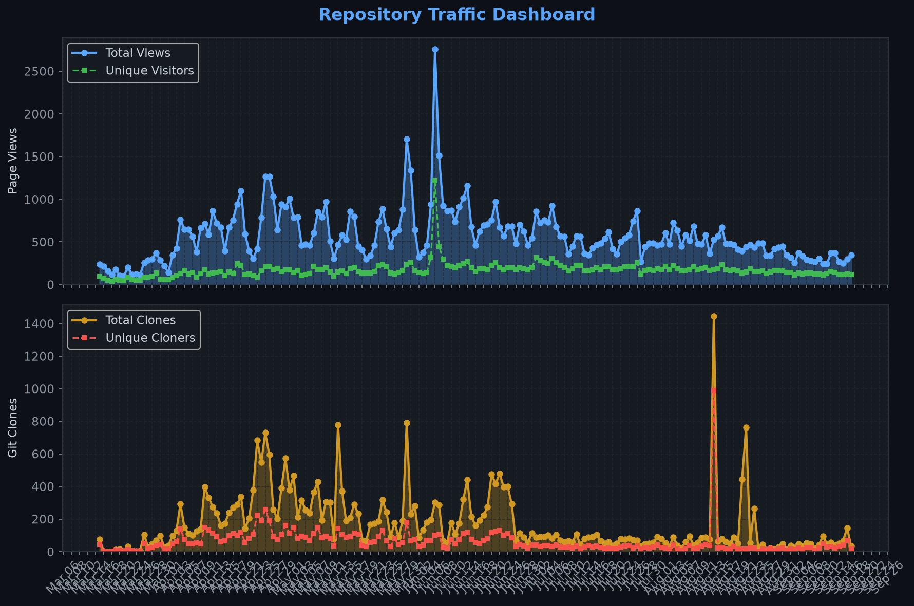
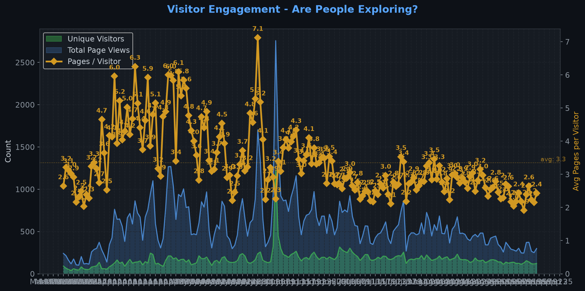
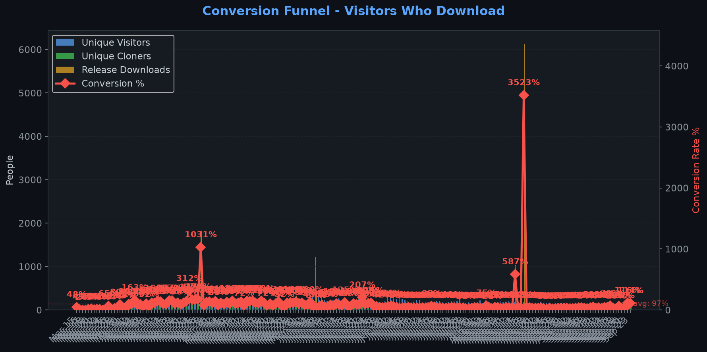
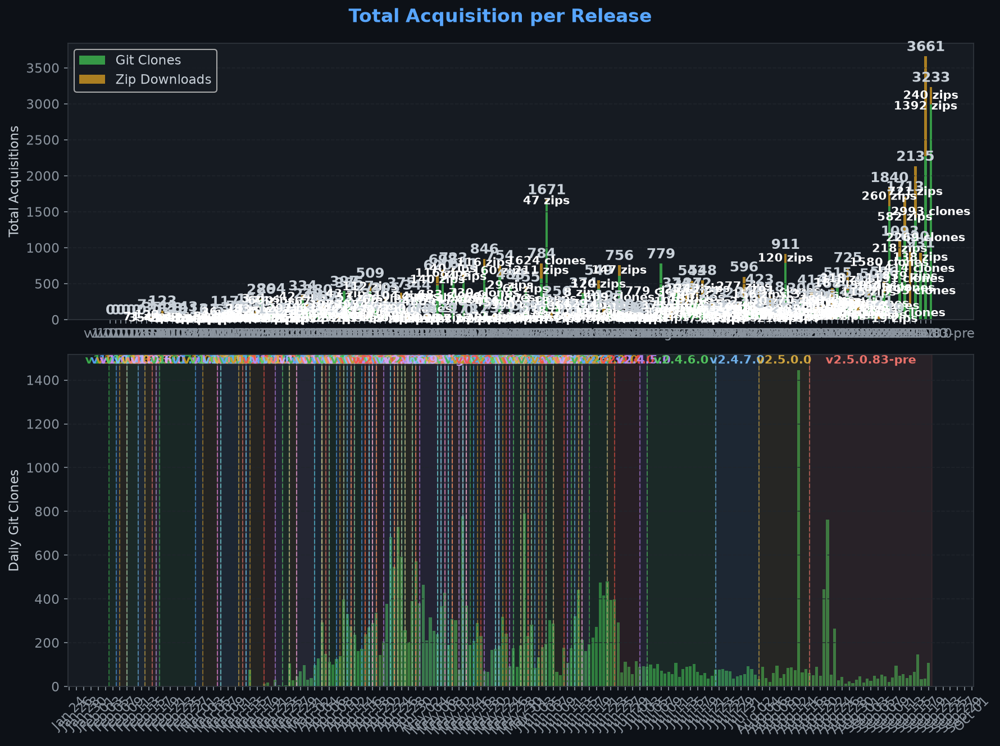
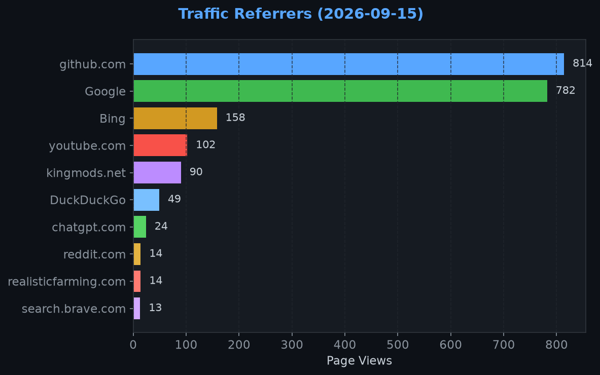
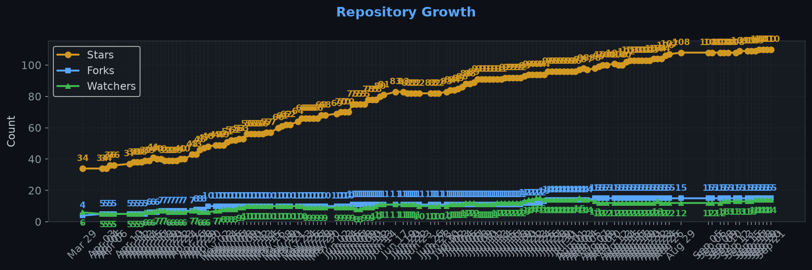

# Repository Traffic Dashboard

**Last updated:** 2026-08-15T18:36:33Z
**Days tracked:** 119 | **Download snapshots:** 1376 (hourly)

---

## Views & Clones (14-day window, preserved forever)

| Metric | 14-Day Total | Unique |
|--------|-------------|--------|
| Page Views | 7556 | 1382 |
| Git Clones | 2260 | 1280 |

> **Engagement:** 5.4 pages per visitor (14-day avg)

---

## Visitor Engagement

> Higher = visitors exploring more pages. 1.0 = bounce. 3.0+ = deeply engaged.

---

## Conversion Funnel

> **14-day conversion:** 7267 of 1382 visitors cloned or downloaded (**525.8%**)
>
> Unique cloners: 1280 | Release downloads: 5987

---

## Total Acquisition per Release (Downloads + Clones)

| Channel | Count |
|---------|-------|
| Zip Downloads | 5987 |
| Git Clones (14-day) | 2260 |
| **Total Acquisitions** | **8247** |

---

## Referrers

| Source | Views | Unique |
|--------|-------|--------|
| github.com | 1565 | 277 |
| Google | 1376 | 446 |
| youtube.com | 311 | 159 |
| Bing | 204 | 82 |
| kingmods.net | 119 | 64 |
| DuckDuckGo | 56 | 7 |
| yandex.ru | 38 | 11 |
| reddit.com | 28 | 15 |
| l.facebook.com | 25 | 12 |
| search.brave.com | 17 | 9 |

---

## Repository Growth

| Metric | Current |
|--------|---------|
| Stars | 102 |
| Forks | 15 |
| Watchers | 12 |

---

## Top Pages (14-day)

| Page | Views | Unique |
|------|-------|--------|
| `/Realistic-Farming/FS25_SoilFertilizer` | 3530 | 1198 |
| `/Realistic-Farming/FS25_SoilFertilizer/releases` | 715 | 262 |
| `/Realistic-Farming/FS25_SoilFertilizer/releases/tag/v2.5.0.0` | 641 | 417 |
| `/Realistic-Farming/FS25_SoilFertilizer/issues` | 440 | 151 |
| `/Realistic-Farming/FS25_SoilFertilizer/releases/tag/v2.4.6.0` | 163 | 113 |
| `/Realistic-Farming/FS25_SoilFertilizer/tree/development` | 129 | 17 |
| `/Realistic-Farming/FS25_SoilFertilizer/discussions` | 123 | 46 |
| `/Realistic-Farming/FS25_SoilFertilizer/pulls` | 108 | 56 |
| `/Realistic-Farming/FS25_SoilFertilizer/blob/main/README.md` | 68 | 24 |
| `/Realistic-Farming/FS25_SoilFertilizer/issues/762` | 67 | 35 |

---

## Data Files

| File | Description | Granularity |
|------|-------------|-------------|
| [daily.json](daily.json) | Views & clones per day (never expires) | Daily |
| [downloads.json](downloads.json) | Release download snapshots | Hourly |
| [referrers.json](referrers.json) | Referrer snapshots | Daily |
| [metadata.json](metadata.json) | Stars, forks, watchers | Daily |
| [stats.json](stats.json) | Combined legacy snapshots | 6-hourly |

---
*Hourly download tracking + full dashboard with engagement metrics every 6 hours*
*Auto-generated by [traffic-stats.yml](../../.github/workflows/traffic-stats.yml)*
