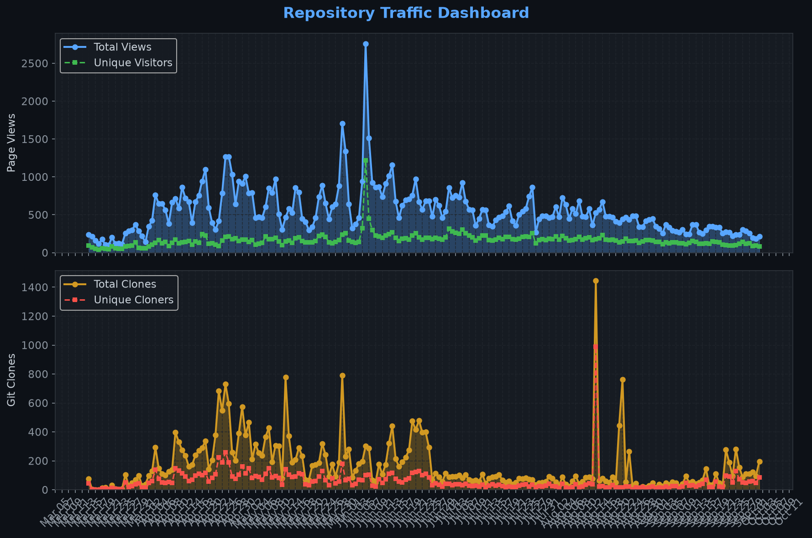
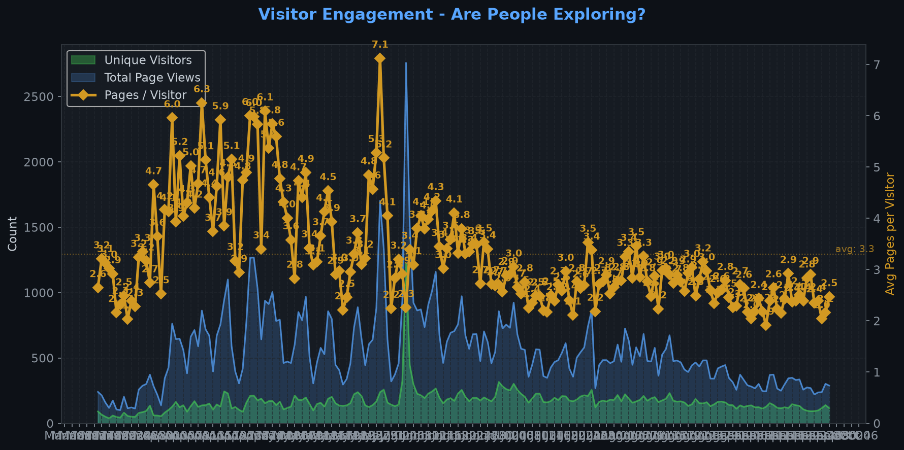
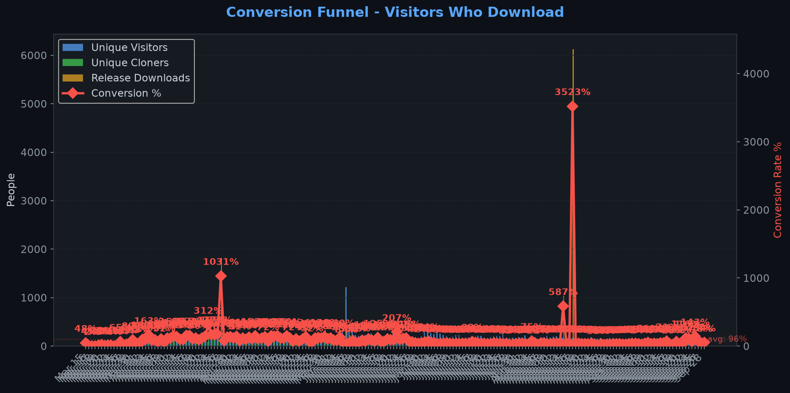
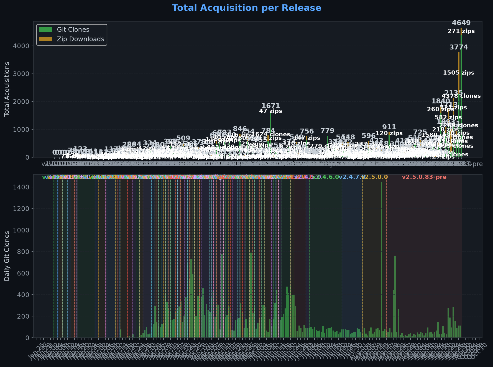
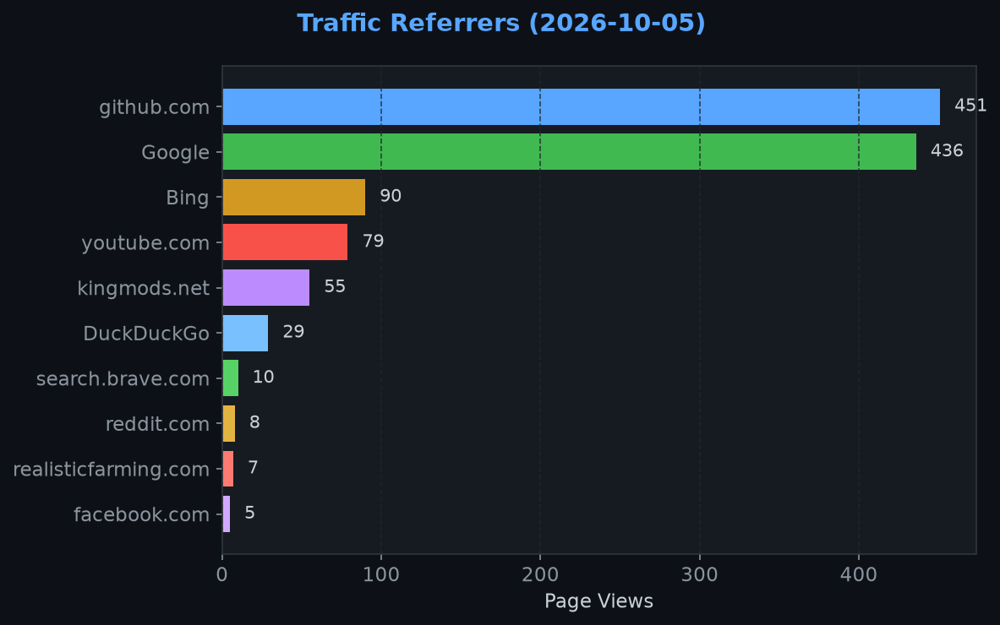
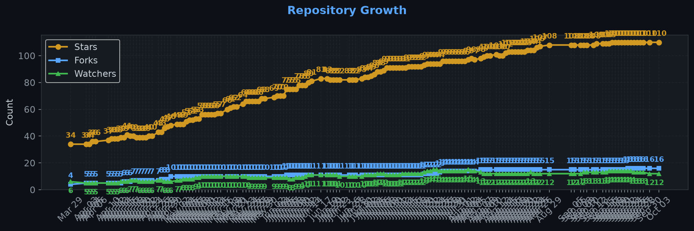

# Repository Traffic Dashboard

**Last updated:** 2026-10-10T18:22:12Z
**Days tracked:** 157 | **Download snapshots:** 1792 (hourly)

---

## Views & Clones (14-day window, preserved forever)

| Metric | 14-Day Total | Unique |
|--------|-------------|--------|
| Page Views | 3382 | 926 |
| Git Clones | 1442 | 492 |

> **Engagement:** 3.6 pages per visitor (14-day avg)

---

## Visitor Engagement

> Higher = visitors exploring more pages. 1.0 = bounce. 3.0+ = deeply engaged.

---

## Conversion Funnel

> **14-day conversion:** 7751 of 926 visitors cloned or downloaded (**837.0%**)
>
> Unique cloners: 492 | Release downloads: 7259

---

## Total Acquisition per Release (Downloads + Clones)

| Channel | Count |
|---------|-------|
| Zip Downloads | 7259 |
| Git Clones (14-day) | 1442 |
| **Total Acquisitions** | **8701** |

---

## Referrers

| Source | Views | Unique |
|--------|-------|--------|
| Google | 433 | 273 |
| github.com | 421 | 189 |
| youtube.com | 94 | 54 |
| Bing | 86 | 56 |
| kingmods.net | 39 | 31 |
| DuckDuckGo | 31 | 9 |
| realisticfarming.com | 13 | 9 |
| l.facebook.com | 11 | 1 |
| reddit.com | 9 | 6 |
| facebook.com | 6 | 6 |

---

## Repository Growth

| Metric | Current |
|--------|---------|
| Stars | 110 |
| Forks | 16 |
| Watchers | 12 |

---

## Top Pages (14-day)

| Page | Views | Unique |
|------|-------|--------|
| `/Realistic-Farming/FS25_SoilFertilizer` | 1504 | 667 |
| `/Realistic-Farming/FS25_SoilFertilizer/releases` | 383 | 156 |
| `/Realistic-Farming/FS25_SoilFertilizer/releases/tag/v2.5.0.0` | 287 | 191 |
| `/Realistic-Farming/FS25_SoilFertilizer/tree/development` | 164 | 43 |
| `/Realistic-Farming/FS25_SoilFertilizer/issues` | 162 | 67 |
| `/Realistic-Farming/FS25_SoilFertilizer/discussions` | 48 | 23 |
| `/Realistic-Farming/FS25_SoilFertilizer/blob/main/README.md` | 46 | 33 |
| `/Realistic-Farming/FS25_SoilFertilizer/branches` | 41 | 17 |
| `/Realistic-Farming/FS25_SoilFertilizer/issues/1098` | 29 | 16 |
| `/Realistic-Farming/FS25_SoilFertilizer/tree/main` | 26 | 15 |

---

## Data Files

| File | Description | Granularity |
|------|-------------|-------------|
| [daily.json](daily.json) | Views & clones per day (never expires) | Daily |
| [downloads.json](downloads.json) | Release download snapshots | Hourly |
| [referrers.json](referrers.json) | Referrer snapshots | Daily |
| [metadata.json](metadata.json) | Stars, forks, watchers | Daily |
| [stats.json](stats.json) | Combined legacy snapshots | 6-hourly |

---
*Hourly download tracking + full dashboard with engagement metrics every 6 hours*
*Auto-generated by [traffic-stats.yml](../../.github/workflows/traffic-stats.yml)*
