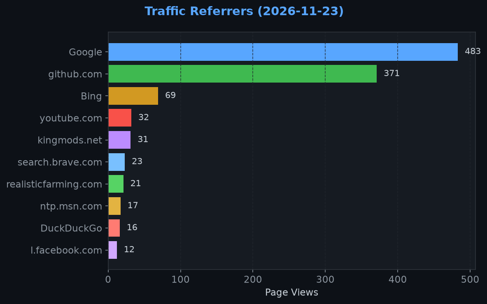

# Repository Traffic Dashboard

**Last updated:** 2026-11-25T12:23:51Z
**Days tracked:** 185 | **Download snapshots:** 1980 (hourly)

---

## Views & Clones (14-day window, preserved forever)

| Metric | 14-Day Total | Unique |
|--------|-------------|--------|
| Page Views | 2872 | 979 |
| Git Clones | 1120 | 341 |

> **Engagement:** 2.9 pages per visitor (14-day avg)

---

## Visitor Engagement

> Higher = visitors exploring more pages. 1.0 = bounce. 3.0+ = deeply engaged.

---

## Conversion Funnel

> **14-day conversion:** 8832 of 979 visitors cloned or downloaded (**902.1%**)
>
> Unique cloners: 341 | Release downloads: 8491

---

## Total Acquisition per Release (Downloads + Clones)

| Channel | Count |
|---------|-------|
| Zip Downloads | 8491 |
| Git Clones (14-day) | 1120 |
| **Total Acquisitions** | **9611** |

---

## Referrers

| Source | Views | Unique |
|--------|-------|--------|
| Google | 458 | 287 |
| github.com | 351 | 167 |
| Bing | 55 | 40 |
| youtube.com | 31 | 26 |
| kingmods.net | 28 | 21 |
| realisticfarming.com | 21 | 17 |
| search.brave.com | 20 | 13 |
| ntp.msn.com | 16 | 1 |
| DuckDuckGo | 15 | 6 |
| l.facebook.com | 11 | 3 |

---

## Repository Growth

| Metric | Current |
|--------|---------|
| Stars | 120 |
| Forks | 17 |
| Watchers | 11 |

---

## Top Pages (14-day)

| Page | Views | Unique |
|------|-------|--------|
| `/Realistic-Farming/FS25_SoilFertilizer` | 1538 | 713 |
| `/Realistic-Farming/FS25_SoilFertilizer/releases` | 280 | 152 |
| `/Realistic-Farming/FS25_SoilFertilizer/releases/tag/v2.6.0.3` | 219 | 175 |
| `/Realistic-Farming/FS25_SoilFertilizer/issues` | 125 | 67 |
| `/Realistic-Farming/FS25_SoilFertilizer/tree/development` | 48 | 26 |
| `/Realistic-Farming/FS25_SoilFertilizer/branches` | 46 | 17 |
| `/Realistic-Farming/FS25_SoilFertilizer/pulls` | 36 | 28 |
| `/Realistic-Farming/FS25_SoilFertilizer/blob/main/README.md` | 30 | 28 |
| `/Realistic-Farming/FS25_SoilFertilizer/releases/tag/v1.0.1.3` | 30 | 23 |
| `/Realistic-Farming/FS25_SoilFertilizer/issues/1154` | 24 | 11 |

---

## Data Files

| File | Description | Granularity |
|------|-------------|-------------|
| [daily.json](daily.json) | Views & clones per day (never expires) | Daily |
| [downloads.json](downloads.json) | Release download snapshots | Hourly |
| [referrers.json](referrers.json) | Referrer snapshots | Daily |
| [metadata.json](metadata.json) | Stars, forks, watchers | Daily |
| [stats.json](stats.json) | Combined legacy snapshots | 6-hourly |

---
*Hourly download tracking + full dashboard with engagement metrics every 6 hours*
*Auto-generated by [traffic-stats.yml](../../.github/workflows/traffic-stats.yml)*
